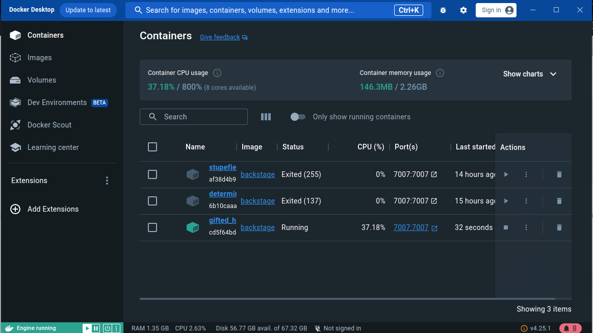
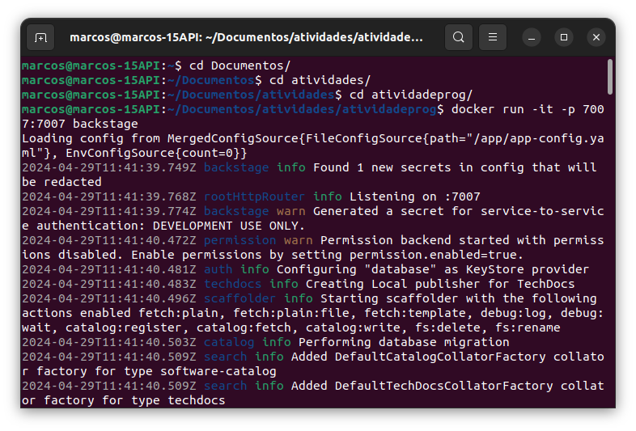
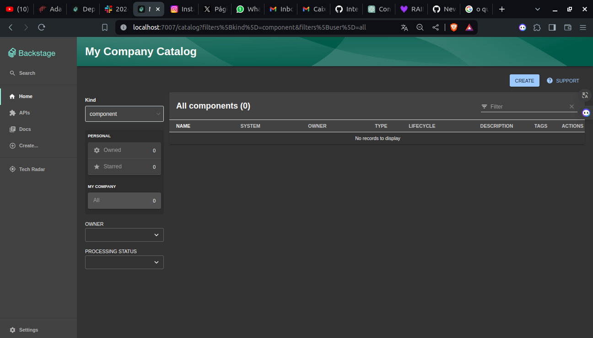

<<<<<<< HEAD
# Backstage com Docker

## Pré-requisitos

Antes de iniciar, certifique-se de ter os seguintes componentes instalados:

- Node.js (Permite a execução de códigos JavaScript fora de um navegador web)
- Yarn (Gerenciador de pacotes para JavaScript)
- Docker (Para criação e gestão de contêineres)
- Git (Sistema de controle de versão)
- Visual Studio Code (VS Code)

## Passo a Passo para Configuração e Execução

### 1. Criar a Aplicação Backstage

Crie uma nova aplicação Backstage executando o comando abaixo e escolha um nome para ela. Este comando gera um diretório com todos os arquivos necessários para a aplicação.

```bash
npx @backstage/create-app@latest --skip-install
```

### 2. Acessar o Diretório da Aplicação

### 3. Instalar Dependências

Instale as dependências necessárias com o seguinte comando:

```bash
yarn install
```

### 4. Preparação do Build

Instale todas as dependências travadas:

```bash
yarn install --frozen-lockfile
```

Compile os tipos TypeScript:

```bash
yarn tsc
```

Construa o backend:

```bash
yarn build:backend
```

**Print do Build do Backend:**


### 5. Construção da Imagem Docker

No diretório raiz do projeto, construa a imagem Docker com o seguinte comando:

```bash
docker image build . -f packages/backend/Dockerfile --tag backstage --no-cache
```

### 6. Execução do Container Docker

Execute o container Docker mapeando a porta 7007 do container para a mesma porta no host:

```bash
docker run -it -p 7007:7007 backstage
```

**Print da Execução do Container:**



### 7. Acesso ao Backstage

Após o container estar funcionando, acesse o Backstage abrindo um navegador e indo para:

```
http://localhost:7007
```

**Print do Acesso ao Backstage:**

